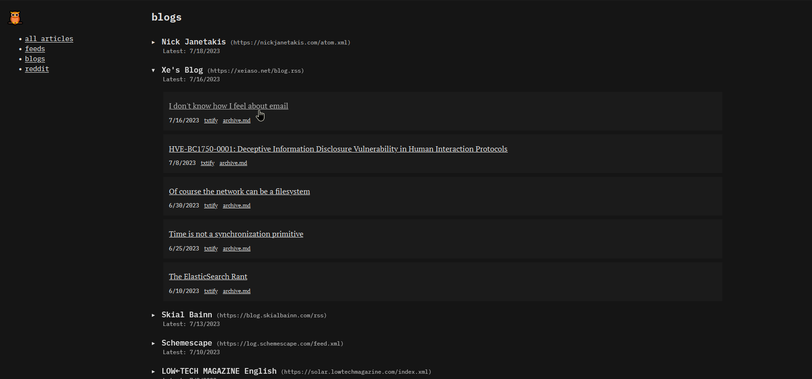

# 🦉 Bubo Reader (Fork)



[Demo Site](https://kevinfiol.com/rss-reader/)

This is a personal fork of the excellent [Bubo Reader](https://github.com/georgemandis/bubo-rss) by George Mandis. I've made several opinionated changes to the setup, including replacing dependencies with more compact alternatives. Please see the original repository for deployment instructions.

Original blogpost: [Introducing Bubo RSS: An Absurdly Minimalist RSS Feed Reader](https://george.mand.is/2019/11/introducing-bubo-rss-an-absurdly-minimalist-rss-feed-reader/)

Blogpost about my fork: [A minimal RSS Feed Reader](https://kevinfiol.com/blog/a-minimal-rss-feed-reader/)

Some enhancements I made:

* Replace `nunjucks` with template strings
* Replace `node-fetch` with Node's native `fetch`
* Many styling changes, including using the `:target` CSS selector to switch between groups (inspired by https://john-doe.neocities.org/)
* The build script now sorts the feeds in each group by which one has the latest updates (this greatly improves the experience, imo)
* An "All Articles" view
* Privacy-redirect support via config file
* Dark mode via `@media (prefers-color-scheme: dark)`

## How to build

Node `>=18.x` required.

```shell
npm install
npm run build
```

## How to host on Github Pages

1. Fork this repo!
2. Enable [Github Pages](https://pages.github.com/) for your repo (either as a project site, or user site)
3. Configure `.github/workflows/build.yml` to your liking
    * Uncomment the `schedule` section to enable scheduled builds